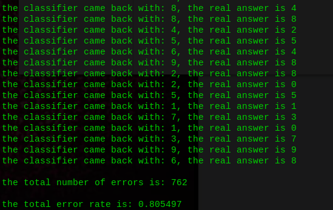
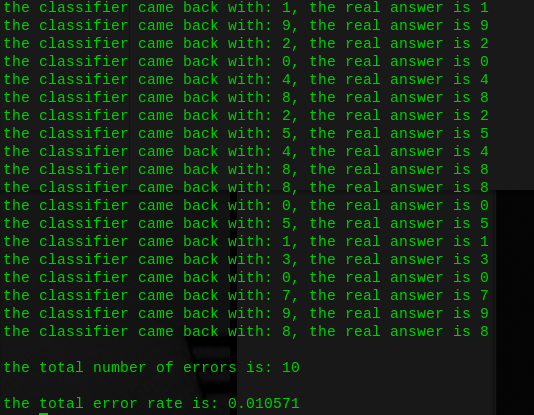
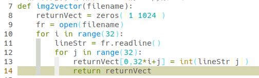

### K-近邻算法

优点: 精度高, 对异常值不敏感, 无数据输入假定.

缺点: 计算复杂度高, 空间复杂度高.

适用数据范围: 数值型和标称型.


### K-近邻算法的一般流程

1). 收集数据: 可以使用任何方法.

2). 准备数据: 距离计算所需要的数值, 最好是结构化的数据格式.

3). 分析数据: 可以使用任何方法.

4). 训练算法, 此方法不适用于K-近邻算法.

5). 测试算法: 计算错误率.

6). 使用算法: 首先需要输入样本数据和结构化的输出结果, 然后运行K-近邻算法判定输入数据分别属于哪一个分类, 最后应用对计算出的分类执行后续的处理.


### 实战项目: 手写识别系统

1). 收集数据: 训练集trainingDigits, 训练集testDigits.

2). 准备数据: 把图像格式转换成分类器可以使用的向量格式.

3). 分析数据: 在Python命令提示符中检查数据, 确保它符合要求.

4). 训练算法, 此方法不适用于K-近邻算法.

5). 测试算法: 编写函数使用提供的部分数据集作为测试集, 测试样本与非测试样本的区别在于测试样本是已经完成分类的数据, 如果预测分类与实际类别不同, 则标记为一个错误.

6). 使用算法: 本项目无此环节.


注: 

1. 如果 `reload()` 提示 `NameError: name 'KNN' is not defined` 那就导入相应模块

```python
from importlib import reload
```

2. 猜猜这是发生了什么?





hhh, 直接说吧, 当教训了啊 ~~(python缩进真香~~

