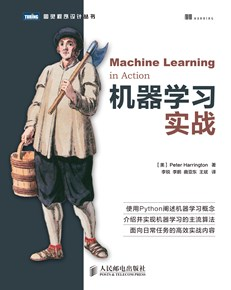

# Machine-Learing-in-Action
图灵社区: [Machine-Learing-in-Action](http://www.ituring.com.cn/book/1021)

机器学习是人工智能研究领域中一个极其重要的研究方向，在现今的大数据时代背景下，捕获数据并从中萃取有价值的信息或模式，成为各行业求生存、谋发展的决定性手段，这使得这一过去为分析师和数学家所专属的研究领域越来越为人们所瞩目。  本书第一部分主要介绍机器学习基础，以及如何利用算法进行分类，并逐步介绍了多种经典的监督学习算法，如k近邻算法、朴素贝叶斯算法、Logistic回归算法、支持向量机、AdaBoost集成方法、基于树的回归算法和分类回归树（CART）算法等。第三部分则重点介绍无监督学习及其一些主要算法：k均值聚类算法、Apriori算法、FP-Growth算法。第四部分介绍了机器学习算法的一些附属工具。

全书通过精心编排的实例，切入日常工作任务，摒弃学术化语言，利用高效的可复用Python代码来阐释如何处理统计数据，进行数据分析及可视化。通过各种实例，读者可从中学会机器学习的核心算法，并能将其运用于一些策略性任务中，如分类、预测、推荐。另外，还可用它们来实现一些更高级的功能，如汇总和简化等。

### 目录

| [版权声明](http://www.ituring.com.cn/book/miniarticle/73795) | [阅读](http://www.ituring.com.cn/book/miniarticle/73795) |
| ------------------------------------------------------------ | -------------------------------------------------------- |
| [献词](http://www.ituring.com.cn/book/miniarticle/43157)     | [阅读](http://www.ituring.com.cn/book/miniarticle/43157) |
| [译者序](http://www.ituring.com.cn/book/miniarticle/25378)   | [阅读](http://www.ituring.com.cn/book/miniarticle/25378) |
| [前言](http://www.ituring.com.cn/book/miniarticle/25292)     | [阅读](http://www.ituring.com.cn/book/miniarticle/25292) |
| [致谢](http://www.ituring.com.cn/book/miniarticle/25296)     | [阅读](http://www.ituring.com.cn/book/miniarticle/25296) |
| [关于本书](http://www.ituring.com.cn/book/miniarticle/2062)  | [阅读](http://www.ituring.com.cn/book/miniarticle/2062)  |
| [关于作者](http://www.ituring.com.cn/book/miniarticle/27587) | [阅读](http://www.ituring.com.cn/book/miniarticle/27587) |
| [关于封面](http://www.ituring.com.cn/book/miniarticle/27588) | [阅读](http://www.ituring.com.cn/book/miniarticle/27588) |
| [第一部分　分类](http://www.ituring.com.cn/book/miniarticle/2063) | [阅读](http://www.ituring.com.cn/book/miniarticle/2063)  |
| [第1章　机器学习基础](http://www.ituring.com.cn/book/miniarticle/2064) | [阅读](http://www.ituring.com.cn/book/miniarticle/2064)  |
| 第2章　k-近邻算法                                            |                                                          |
| 第3章　决策树                                                |                                                          |
| [第4章　基于概率论的分类方法：朴素贝叶斯](http://www.ituring.com.cn/book/miniarticle/32007) | [阅读](http://www.ituring.com.cn/book/miniarticle/32007) |
| 第5章　Logistic回归                                          |                                                          |
| 第6章　支持向量机                                            |                                                          |
| 第7章　利用AdaBoost元算法提高分类性能                        |                                                          |
| 第二部分　利用回归预测数值型数据                             |                                                          |
| 第8章　预测数值型数据：回归                                  |                                                          |
| 第9章　树回归                                                |                                                          |
| 第三部分　无监督学习                                         |                                                          |
| 第10章　利用Ｋ-均值聚类算法对未标注数据分组                  |                                                          |
| 第11章　使用Apriori算法进行关联分析                          |                                                          |
| 第12章　使用FP-growth算法来高效发现频繁项集                  |                                                          |
| 第四部分　其他工具                                           |                                                          |
| 第13章　利用PCA来简化数据                                    |                                                          |
| 第14章　利用SVD简化数据                                      |                                                          |
| 第15章　大数据与MapReduce                                    |                                                          |
| 附录A　Python入门                                            |                                                          |
| 附录B　线性代数                                              |                                                          |
| 附录C　概率论复习                                            |                                                          |
| 附录D 资源                                                   |                                                          |